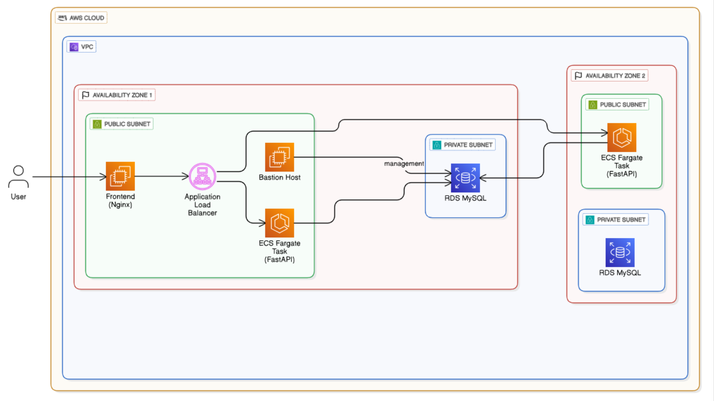

# 📚 Sistema de Biblioteca en la Nube | CRUD con AWS, FastAPI y Docker

Aplicación web CRUD para la gestión de biblioteca, desplegada sobre una arquitectura moderna en la nube utilizando servicios de AWS. El sistema está diseñado con enfoque en **escalabilidad, seguridad y alta disponibilidad**.

---

## 🚀 Descripción

Este proyecto implementa una solución desacoplada en tres capas:

- **Frontend**: Aplicación web estática servida con Nginx en EC2  
- **Backend**: API REST desarrollada con FastAPI y desplegada en contenedores (ECS Fargate)  
- **Base de datos**: MySQL en Amazon RDS (subnets privadas)

El tráfico es gestionado mediante un **Application Load Balancer (ALB)** que distribuye las solicitudes hacia el backend.

---

## 🧱 Arquitectura

La solución sigue una arquitectura en la nube basada en:

- VPC con subnets públicas y privadas
- ECS Fargate para ejecución de contenedores
- RDS en subredes privadas (no expuesto a internet)
- EC2 como servidor frontend y bastion host
- ECR para almacenamiento de imágenes Docker
- ALB para balanceo de carga

### 📊 Diagrama de Arquitectura

> 📌 Coloca tu imagen en la carpeta `docs/` del repositorio con el nombre `arquitectura.png`

---

## ⚙️ Tecnologías utilizadas

- **Backend**: FastAPI (Python)
- **Frontend**: HTML, CSS, JavaScript + Nginx
- **Contenedores**: Docker
- **Cloud**: AWS  
  - ECS Fargate  
  - EC2  
  - RDS (MySQL)  
  - ECR  
  - Application Load Balancer  
- **Red y seguridad**: VPC, Subnets, Security Groups

---

## 🔄 Flujo de la aplicación

1. El usuario accede al frontend (EC2 + Nginx)
2. El frontend consume la API mediante el DNS del ALB
3. El ALB distribuye el tráfico hacia ECS Fargate
4. El backend procesa la lógica y consulta RDS
5. La base de datos responde al backend de forma segura

---

## 🔐 Seguridad

- Base de datos en subnets privadas (sin acceso público)
- Uso de **Security Groups** para control de tráfico
- Acceso administrativo mediante **Bastion Host (EC2)**
- Separación de capas (frontend, backend, DB)

---

## 🐳 Despliegue del Backend

- Desarrollo en FastAPI
- Contenerización con Docker
- Subida de imagen a Amazon ECR
- Despliegue en ECS Fargate (2 tareas en alta disponibilidad)
- Integración con ALB mediante Target Group

---

## 🌐 Despliegue del Frontend

- Aplicación estática alojada en EC2
- Servida con Nginx
- Comunicación con backend vía DNS del Load Balancer
- Puerto 80 habilitado para tráfico HTTP

---

## 🗄️ Base de Datos

- Amazon RDS (MySQL)
- Alta disponibilidad en múltiples zonas
- Acceso restringido únicamente a servicios internos
- Configuración mediante DB Subnet Group

---

## 📌 Conclusión

Este proyecto demuestra la implementación de una arquitectura cloud robusta en AWS, aplicando buenas prácticas como:

- Desacoplamiento de servicios
- Seguridad por capas
- Uso de contenedores
- Alta disponibilidad

Sirve como base sólida para futuros sistemas escalables y productivos.

---

## 👥 Integrantes

- Eynar Morales  
- Virgilio Villalaz  
- Kenshin Ng  
